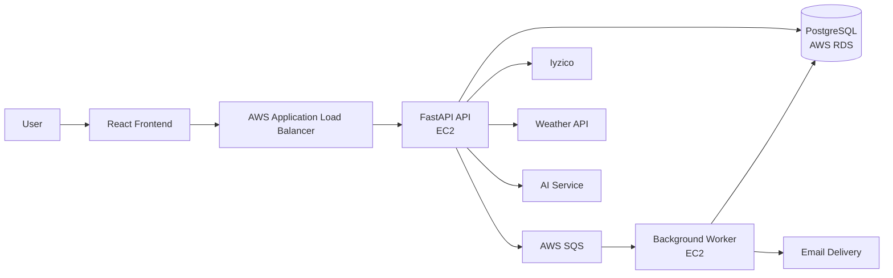

# PortaBilet

PortaBilet is a full-stack event ticketing platform built to explore not only application development, but also cloud infrastructure, asynchronous processing, and Infrastructure as Code.

The platform supports event discovery and management, ticket purchasing and transfer, favorites and reviews, payment integration, calendar export, weather information, and AI-assisted event search.

## Architecture



## Tech Stack

| Layer | Technologies |
| --- | --- |
| Frontend | React, Vite, Tailwind CSS |
| Backend | Python, FastAPI, SQLAlchemy |
| Database | PostgreSQL, AWS RDS |
| Cloud | AWS EC2, ALB, RDS, SQS |
| Infrastructure | Terraform |
| Async Processing | Amazon SQS, Python Worker |
| Payments | Iyzico |
| AI | Google GenAI |
| Development | Git, REST APIs |

## Cloud Architecture

The AWS infrastructure is provisioned with **Terraform**.

The current infrastructure includes:

- Custom VPC
- Public and private subnets
- NAT Gateway
- Application Load Balancer
- EC2 instance for the FastAPI producer/API
- Separate EC2 instance for the asynchronous consumer worker
- PostgreSQL database on Amazon RDS
- Amazon SQS queue
- IAM roles and security groups

Application services are deployed into private subnets while traffic to the API is routed through the Application Load Balancer.

## Asynchronous Ticket Processing

Ticket creation uses a producer/consumer pattern.

Instead of performing all post-purchase work inside the HTTP request:

1. The API processes the purchase.
2. A message is published to Amazon SQS.
3. A separate worker consumes the message.
4. The ticket is persisted to PostgreSQL.
5. The user receives an e-mail notification.
6. The processed message is removed from the queue.

This separates background work from the API request lifecycle and provides a foundation for more scalable processing.

## Main Features

- User authentication
- Event creation and management
- Event discovery
- Ticket purchasing
- Ticket transfer
- User favorites
- Event reviews
- Iyzico payment integration
- E-mail notifications
- Calendar export
- Weather information
- AI-assisted natural-language event search
- Asynchronous ticket processing

## Repository Structure

```text
PortaBilet/
├── bilet-backend/      # FastAPI backend and SQS worker
├── bilet-frontend/     # React frontend
├── bilet-terraform/    # AWS infrastructure as code
└── stress.yml          # Load/stress configuration
```

## Infrastructure as Code

Terraform configurations are located under:

```text
bilet-terraform/
```

Resources are separated by responsibility:

```text
alb.tf
ec2.tf
rds.tf
sqs.tf
security_groups.tf
variables.tf
outputs.tf
```

This keeps application code and infrastructure definitions in the same project while maintaining a clear separation of responsibilities.

## Backend

The backend is implemented with **FastAPI** and **SQLAlchemy**.

Main dependencies include:

- FastAPI
- SQLAlchemy
- PostgreSQL
- boto3
- PyJWT
- Iyzico SDK
- Google GenAI
- Uvicorn

## Frontend

The frontend is built with:

- React
- Vite
- React Router
- Tailwind CSS

## What I Learned

This project was primarily an exercise in connecting application development with cloud infrastructure.

The most valuable parts of the project were:

- Designing AWS networking and compute resources
- Managing infrastructure through Terraform
- Separating synchronous API traffic from background processing
- Working with queues using Amazon SQS
- Deploying backend services on EC2
- Integrating a managed PostgreSQL database through RDS
- Managing application configuration across multiple services

## Author

**Çağrı İnan Çamlı**

Computer Engineering @ Konya Technical University  
Focused on Cloud, DevOps and Backend Engineering

[GitHub](https://github.com/cagriinan46) · [LinkedIn](https://www.linkedin.com/in/cagri-inan-camli)
