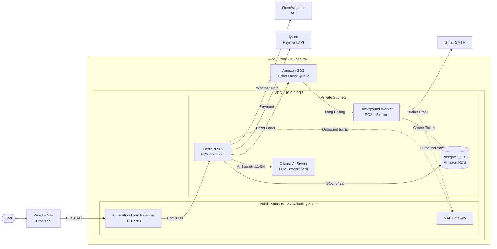
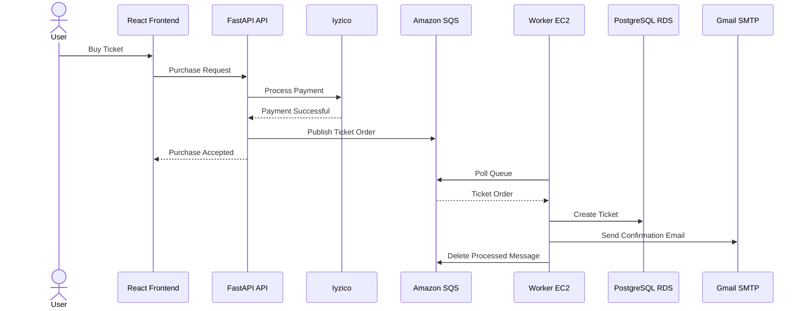

# PortaBilet

PortaBilet is a full-stack event ticketing platform built to explore application development together with cloud infrastructure, asynchronous processing, Infrastructure as Code, and self-hosted AI inference.

The platform supports event discovery and management, ticket purchasing and transfer, favorites and reviews, payment integration, calendar export, weather information, e-mail notifications, and AI-assisted natural-language event search.

## Highlights

- Full-stack event ticketing platform
- FastAPI backend and React frontend
- AWS infrastructure provisioned with Terraform
- Application services deployed inside private subnets
- Internet-facing Application Load Balancer
- PostgreSQL on Amazon RDS
- Asynchronous ticket processing with Amazon SQS
- Dedicated background worker on EC2
- Self-hosted Ollama inference server on EC2
- Iyzico sandbox payment integration
- OpenWeather API integration
- Gmail SMTP ticket notifications
- Terraform remote state stored in encrypted Amazon S3
- Load testing with Artillery

## Architecture


```mermaid
flowchart LR

    User(["User"])
    Frontend["React + Vite<br/>Frontend"]

    User --> Frontend

    subgraph AWS["AWS Cloud · eu-central-1"]

        subgraph VPC["VPC · 10.0.0.0/16"]

            subgraph Public["Public Subnets · 2 Availability Zones"]
                ALB["Application Load Balancer<br/>HTTP :80"]
                NAT["NAT Gateway"]
            end

            subgraph Private["Private Subnets"]
                API["FastAPI API<br/>EC2 · t3.micro"]
                Worker["Background Worker<br/>EC2 · t3.micro"]
                Ollama["Ollama AI Server<br/>EC2 · qwen2.5:7b"]
                RDS[("PostgreSQL 15<br/>Amazon RDS")]
            end

        end

        SQS["Amazon SQS<br/>Ticket Order Queue"]

    end

    Iyzico["Iyzico<br/>Payment API"]
    Weather["OpenWeather<br/>API"]
    Gmail["Gmail SMTP"]

    Frontend -->|"REST API"| ALB
    ALB -->|"Port 8000"| API

    API -->|"SQL :5432"| RDS
    API -->|"AI Search :11434"| Ollama

    API -->|"Ticket Order"| SQS
    SQS -->|"Long Polling"| Worker

    Worker -->|"Create Ticket"| RDS
    Worker -->|"Ticket Email"| Gmail

    API -->|"Payment"| Iyzico
    API -->|"Weather Data"| Weather

    API -.->|"Outbound traffic"| NAT
    Worker -.->|"Outbound traffic"| NAT
```

## Asynchronous Ticket Processing

Ticket creation uses a producer/consumer pattern.

After a successful payment, the API publishes a ticket order to Amazon SQS instead of completing all post-purchase work inside the HTTP request. A separate worker consumes the message, creates the ticket record, sends the confirmation e-mail, and removes the processed message from the queue.


```mermaid
sequenceDiagram
    actor User

    participant FE as React Frontend
    participant API as FastAPI API
    participant IYZ as Iyzico
    participant SQS as Amazon SQS
    participant Worker as Worker EC2
    participant DB as PostgreSQL RDS
    participant Mail as Gmail SMTP

    User->>FE: Buy Ticket
    FE->>API: Purchase Request
    API->>IYZ: Process Payment
    IYZ-->>API: Payment Successful

    API->>SQS: Publish Ticket Order
    API-->>FE: Purchase Accepted

    Worker->>SQS: Poll Queue
    SQS-->>Worker: Ticket Order

    Worker->>DB: Create Ticket
    Worker->>Mail: Send Confirmation Email
    Worker->>SQS: Delete Processed Message
```

This separates background work from the request lifecycle and provides a foundation for more scalable asynchronous processing.

## Cloud Infrastructure

The AWS infrastructure is defined with Terraform. When provisioned, it includes:

- Custom VPC: `10.0.0.0/16`
- Region: `eu-central-1`
- 2 Availability Zones
- 2 public subnets
- 2 private subnets
- NAT Gateway
- Internet-facing Application Load Balancer
- EC2 instance for the FastAPI producer/API
- Separate EC2 instance for the background consumer worker
- Separate EC2 instance for the Ollama AI server
- PostgreSQL 15 on Amazon RDS
- Amazon SQS ticket-order queue
- IAM roles and instance profiles
- Security groups
- Encrypted Terraform remote state in Amazon S3

Application services are placed in private subnets. Public HTTP traffic reaches the backend through the Application Load Balancer.

## Network and Security Model

The main network path is:

```text
Internet
   |
   | :80
   v
Application Load Balancer
   |
   | :8000
   v
FastAPI EC2
   |
   +---- :5432 ----> PostgreSQL RDS
   |
   +---- :11434 ---> Ollama EC2
```

The backend EC2 security group only accepts application traffic from the ALB security group.

The RDS security group accepts PostgreSQL traffic from the application EC2 security group, while the Ollama security group accepts model API traffic from the backend EC2 layer.

RDS is not publicly accessible.

## AI-Assisted Event Search

PortaBilet includes a natural-language event search flow.

The backend uses a self-hosted Ollama server running on a dedicated EC2 instance. The default Terraform configuration currently uses:

```text
qwen2.5:7b
```

The FastAPI backend communicates with Ollama over the private network on port `11434`.

The AI layer is used to interpret conversational search requests and convert them into structured event filters such as:

- City
- Category
- Start date
- End date

The application also includes deterministic handling for common requests and falls back to the local LLM when necessary.

## Deployment Model

The current project does not rely on a GitHub Actions deployment pipeline.

Terraform provisions the EC2 instances and their bootstrap process is handled through EC2 `user_data`.

The deployment flow is roughly:

```text
Terraform Apply
      |
      v
Create EC2 Instance
      |
      v
Clone PortaBilet Repository
      |
      v
Create Python Virtual Environment
      |
      v
Install Dependencies
      |
      v
Generate Environment Configuration
      |
      v
Create systemd Service
      |
      v
Start Application / Worker
```

The API and worker are configured as `systemd` services so they can restart automatically.

## Terraform State

Terraform uses an Amazon S3 backend for remote state storage.

The test deployment and its state bucket have been destroyed. A new state bucket must be created before running `terraform init` for a future deployment.

The backend configuration uses:

- Amazon S3
- Encryption enabled
- S3 lockfile support
- AWS account restriction

This keeps infrastructure state outside the local development machine.

## Tech Stack

| Layer | Technologies |
| --- | --- |
| Frontend | React 19, Vite, Tailwind CSS |
| Backend | Python, FastAPI, SQLAlchemy |
| Database | PostgreSQL 15, Amazon RDS |
| Cloud | AWS EC2, ALB, RDS, SQS, VPC, IAM, S3 |
| Infrastructure | Terraform |
| Async Processing | Amazon SQS, Python Worker |
| AI | Ollama, Qwen 2.5 |
| Payments | Iyzico |
| Weather | OpenWeather API |
| E-mail | Gmail SMTP |
| Process Management | systemd |
| Load Testing | Artillery |
| Development | Git, REST APIs |

## Main Features

- User authentication
- Event creation and management
- Event discovery
- Admin event management
- Ticket purchasing
- Ticket transfer
- User favorites
- Event reviews
- Iyzico payment integration
- Asynchronous ticket processing
- E-mail ticket notifications
- Calendar export
- Weather information
- AI-assisted conversational event search

## Load Testing

The repository includes an Artillery stress-test configuration. Set `TARGET_URL` to the address of a running deployment before starting a test; the previous test Application Load Balancer has been deleted.

The current test ramps traffic from 20 to 50 arrivals per second against the events API.

```text
stress.yml
```

For example, after a future deployment:

```bash
TARGET_URL="http://<new-alb-dns-name>" artillery run stress.yml
```

## Repository Structure

```text
PortaBilet/
├── bilet-backend/      # FastAPI backend, services and SQS worker
├── bilet-frontend/     # React + Vite frontend
├── bilet-terraform/    # AWS infrastructure as code
├── stress.yml          # Artillery load/stress test
└── README.md
```

## Infrastructure as Code

Terraform resources are separated by responsibility:

```text
bilet-terraform/
├── main.tf
├── providers.tf
├── variables.tf
├── outputs.tf
├── alb.tf
├── ec2.tf
├── rds.tf
├── sqs.tf
└── security_groups.tf
```

This keeps the application and infrastructure in the same repository while maintaining a clear separation of responsibilities.

## Backend

The backend is implemented with FastAPI and SQLAlchemy.

Key responsibilities include:

- Authentication
- Event management
- Ticket operations
- Payment processing
- SQS message publishing
- AI-assisted search
- Weather integration
- Database access

The background worker independently consumes SQS messages and handles ticket persistence and confirmation e-mails.

## Frontend

The frontend is built with React and Vite.

Main technologies include:

- React
- React Router
- Tailwind CSS
- React Hot Toast
- Vite

The frontend communicates with the backend through the configured `VITE_API_URL`.

## What I Learned

This project was primarily an exercise in connecting application development with real cloud infrastructure.

The most valuable parts of the project were:

- Designing AWS networking across public and private subnets
- Managing infrastructure with Terraform
- Running application workloads on EC2
- Using an Application Load Balancer as the public entry point
- Separating synchronous API traffic from asynchronous background processing
- Working with queues through Amazon SQS
- Managing PostgreSQL through Amazon RDS
- Running a self-hosted LLM service inside the private AWS network
- Bootstrapping servers with EC2 user data
- Managing long-running services with systemd
- Storing Terraform state remotely in Amazon S3
- Integrating external payment and weather services
- Load testing a deployed API

## Author

**Çağrı İnan Çamlı**

Computer Engineering @ Konya Technical University  
Focused on Cloud, DevOps and Backend Engineering

[GitHub](https://github.com/cagriinan46) · [LinkedIn](https://www.linkedin.com/in/cagri-inan-camli)
